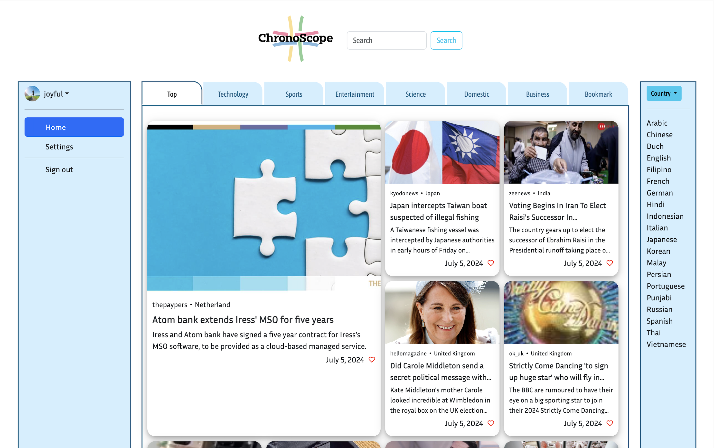

# News Portal Website
# Overview
The News-Portal website is a web application designed to provide users with news from around the world. Users can select a country to view news specific to that region and choose a language to view the news in some countries. This application aims to increase interest in global events and deepen users' knowledge of current happenings worldwide.

# Features
- Global News Access: Users can view news from different countries around the globe. 
- Country Selection: Users can select a specific country to view news relevant to that region. 
- Language Options: Users can choose the language they want to read the news. 
- Enhanced User Engagement: The application encourages users to stay informed about global events and issues.

# Technical Specifications
## Frontend
HTML/CSS: For structuring and styling the web pages. 
JavaScript: For dynamic content and interactive elements. 
jQuery: For simplifying JavaScript operations and handling AJAX requests. 
## Backend
Python/Django: For handling server-side logic and API integration. 
Django REST Framework: For creating a robust and scalable API.
### Database
SQLite: For storing user preferences and application data.
## API Integration
News API: To fetch real-time news articles based on user-selected countries and languages.

# Final Product

See details: [ChronoScope Documentation]()

Website at a glance: <https://youtu.be/K-PTAUvCrZ4>

